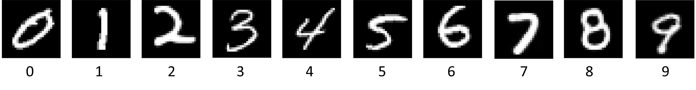
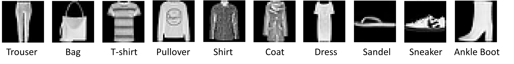
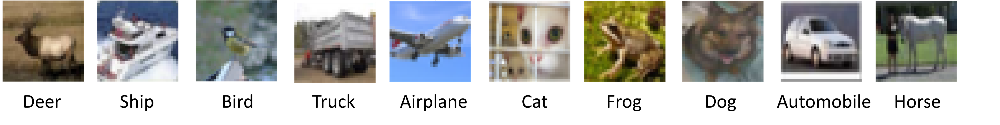
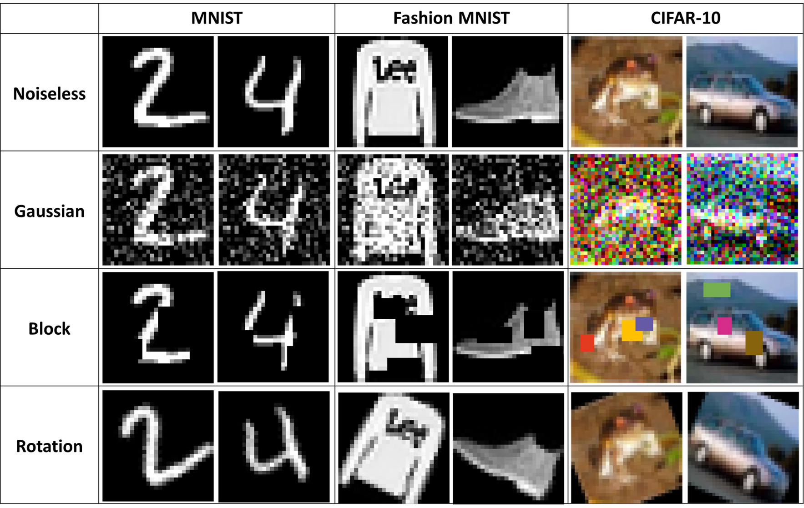
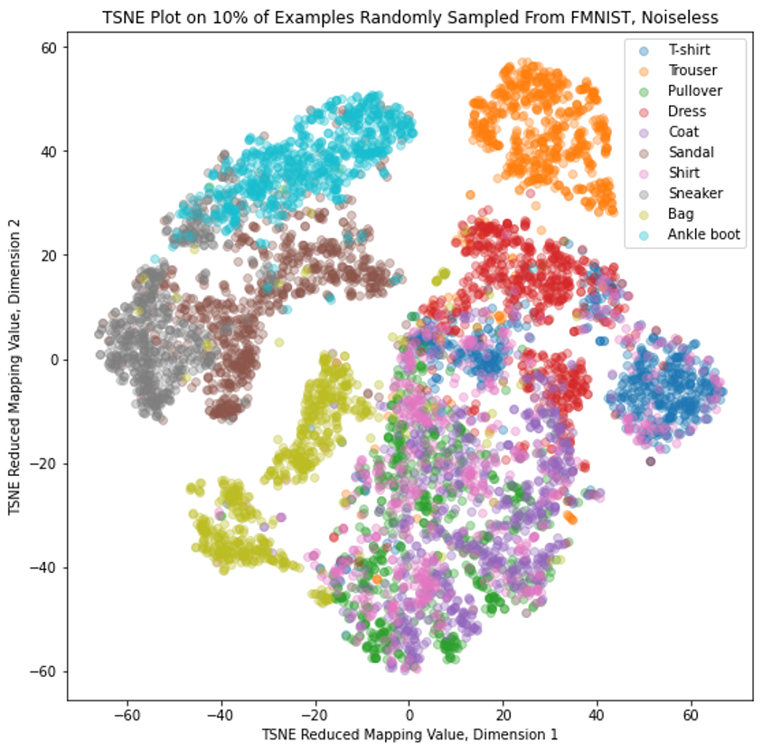
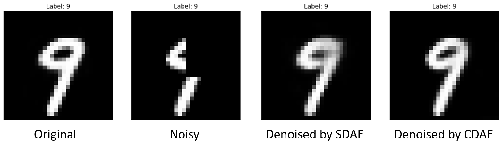
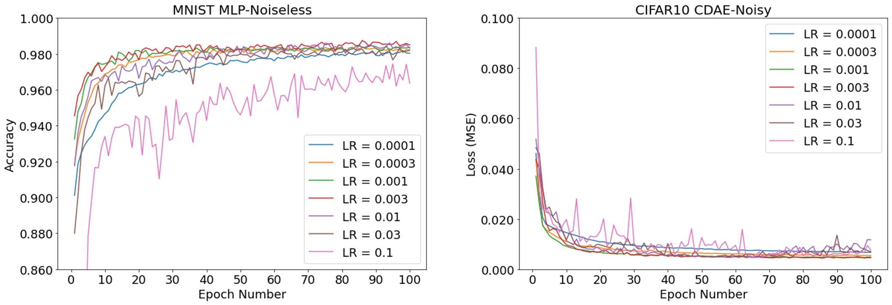
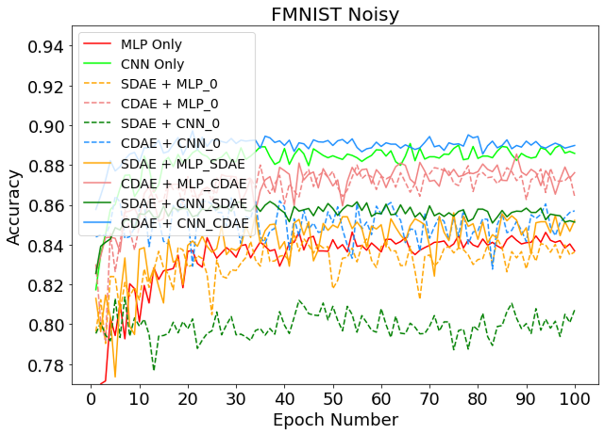

# Comparing Deep Learning Strategies for Noisy Image Recognition
 
Note: this is the final project of an AI course that I have taken at the University of Waterloo. My responsibility in this (group) project is to write and test all the code, including producing the figures. The video presentation and report of the final project are not included in this repository as they are not entirely of my work. The work presented in this repository are entirely of my own.

This is the code repository for CS486 Group 6 Final Project: Comparing Deep Learning Strategies for Noisy Image Recognition. Image recognition is a common classification task with real-life applications. However, images are often corrupted by noises such as static (or Gaussian noise) during transmission, blockages or rotations. Therefore, robust methods to effectively identify object in noisy images are important for real-world applications of image recognition. In this project we explore and compare different ways of recognizing noisy images using deep learning methods. 

We conduct our tests on three classic ML datasets:

* **[MNIST]** handwritten digits database with 10 classes:
  <p align="left">
  
  </p>
  This dataset is considered a standard benchmark in ML and is pretty easy. Images are black and white, examples in each class look distinct from each other, and samples are captured from the same angle.
  
* **[Fashion MNIST]** clothing article database with 10 classes:
  <p align="left">
  
  </p>
  This dataset is still black and white, but the blurring class borders make recognition more difficult. For example, pullover, shirt and coat can look similar to each other.

* **[CIFAR-10]** common objects dataset with 10 classes:
  <p align="left">
  
  </p>
  This is the most difficult of our datasets by a long shot. Not only are images colored and class borders blurred (like Automobile vs Truck), the images can also be taken from multiple angles and using different backgrounds. Occasionally an object of non-interest (like a human pulling the horse) is also in the image.

[MNIST]: http://yann.lecun.com/exdb/mnist/
[Fashion MNIST]: https://www.kaggle.com/zalando-research/fashionmnist
[CIFAR-10]: https://www.cs.toronto.edu/~kriz/cifar.html


More details on these datasets can be found in their correponding links and in our paper. For each dataset, we add 3 types of noises: Block, Gaussian and Rotation. These noises simulate noises that a classifier may encounter in real life:
<p align="left">

</p>


We use the following models to perform noisy image recognition:
* **Multi-layered Perceptron (MLP)**.  A basic multi-layered, fully-connected neural network.
* **Convolutional Neural Network (CNN)**.  A neural network with sliding-window convolutional layers to capture spatial correlation (local connectedness for example) of images, as well as pooling layers to identify most active features.
* **Stacked Denoising Autoencoder (SDAE)**.  An MLP trained on a noisy set, with the noiseless image as the label. It achieves denoising by compressing the image into a lower dimension and then reconstructing it. Note that this is not a classifier, but it can help classifiers to achieve better accuracy by reducing the noise.
* **Convolutional Denoising Autoencoder (CDAE)**.  Does the same job as the SDAE, but with convolutional layers like the CNN.


More details on these models can be found in our paper. We have decided to construct all models by ourselves instead of taking pre-built "big name" models like ResNet or Inception, because we are mainly looking for method comparison rather than state-of-the-art performance. We compare two categories of methods: direct-classify (train and test MLP or CNN directly), or Denoise-then-classify (denoise images with an SDAE or CDAE, then feed the result to an MLP or CNN). Among the denoise-then-classify methods, we have two approaches: training the classifier on noiseless training set or on the noisy training set that has been denoised by the correponding denoiser beforehand. The first approach assumes that the denoiser removes enough noise from the noisy image so that the image looks essentially noise-free; the second approach assumes considerable differences between denoised images and noiseless (ground truth) images, and allows the classifier to adapt to the output of the correponding denoiser instead of noiseless images.

We test the following set of 10 methods on each dataset with and without noise: MLP, CNN, SDAE+MLP_0, SDAE+MLP_SDAE, CDAE+MLP_0, CDAE+MLP_CDAE, SDAE+CNN_0, SDAE+CNN_SDAE, CDAE+CNN_0, CDAE+CNN_CDAE. The \_0, \_SDAE and \_CDAE after a classifier respectively indicate that the classifier has been trained on the noiseless training set, the noisy training set that has been denoised by the SDAE, and the noisy training set that has been denoised by the CDAE.

## Required Libraries
Our code uses the following libraries:
* **TensorFlow (2.0+)** as the backend library for all our deep learning models
* **Keras** as a high-level wrapper over TensorFlow to make code cleaner and more readable
* **NumPy** as a data manipulation tool for preprocessing and reshaping datasets
* **Pandas** for dataframes used in the TSNE computation
* **Sklearn** for TSNE computation
* **cv2 and Skimage** for adding noises to our images
* **MatPlotLib** for visualizing our results
* **(Optional) gc** for reducing RAM usage
* **(Optional) psutil** to help monitor hardware accelerator specifications on Colab

## Running Our Code
To get all the results, you may simply run:
```python
python ImageClassifier.py
```
or 
```python
python3 ImageClassifier.py
```
However, this may end up consuming a lot of memory and time. You can choose to run separate functions instead. The essential functions (that cannot be omitted) are
```python
# Instantiate the ImageClassifier object
classifier = ImageClassifier()
# Load dataset. Use load_dataset(dataset, True) to show summary and example images
classifier.load_dataset(dataset, False)
# Add noise to the dataset. add_noise(True) to show examples of noisy images
classifier.add_noise(False)
# Preprocess data into noisy and noiseless training sets, as well as appropriate shape for each model
classifier.preprocess_data()
```
These functions only take a few minutes as they do not involve any neural networks. After this, you may choose to visualize the data by plotting a **[TSNE](http://www.cs.toronto.edu/~hinton/absps/tsne.pdf)** graph. TSNE is an algorithm to project an example with very high dimensions (like an image) into a much lower dimension (2 in our case) such that clustering is preserved. Visually, each cluster of points on the 2-D TSNE plot represents a group of examples that "look similar enough" in the high-dimensional representation. You may produce TSNE plots on the noisy and noiseless datasets by calling the function:

```python
classifier.tsne()
```
And here is a sample TSNE result:
<p align="left">

</p>

You may also want to see how well a classifier denoises an image visually. This is done by calling the function
```python
classifier.show_denoised_images()
```
which output some images like
<p align="left">

</p>

By default this function shows you 10 examples. You can increase the number of examples shown by modifying the line 

```python
sample_size = 10
```

in the show_denoised_images() function. To replicate our hyperparameter tuning process, run the functions

```python
# Test 7 different optimizers (everything else are initial hyperparameters mentioned in the paper)
classifier.train_models("Optimizers")
# Test 7 different learning rates, using best optimizer found in the Optimizers test
classifier.train_models("Learning Rate")
# Test 7 different batch sizes, using best optimizers and learning rates found in previous 2 tests
classifier.train_models("Batch Size")
```

After each function is run, some graphs will be produced to show validation accuracy during training, such as:
<p align="left">

</p>
To produce final results only, run the function

```python
classifier.train_models("Comparison")
```

which reports validation accuracies by producing graphs such as:
<p align="left">

</p>
and also print out testing accuracy as a number after each model. Note that because of intra-GPU randomizations, NumPy and TensorFlow seeds are unable to make results fully reproducible. Your validation and testing results may vary very slightly from ours.


